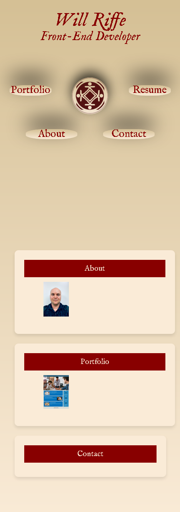

# portfolio
My personal portfolio webpage

## Summary
A portfolio is a necessary construction for a web developer. Whether it's a potential employer, or to other professionals, a web developer is best served by having a website dedicated to displaying their best work. The webpage (soon to be webpages*) are meant to be my own solution to this need; my own portfolio webpage. 

## Features

> **Displaying my current work!**
>
>
> * The page starts with a large header, with buttons to navigate around the page/site.
 >
> * There is an "about me" section (to be filled) where potential employers may see a relatively recent photo of myself.
>
> * The webpage contains a rough portfolio section which I will be periodically updating to display weekly challenges. I currently have just one up, but will put up more in the near future.
>
> * The "contact" section is currently empty, but will soon be filled out
>
> * The index.html has been structured using semantic html elements.
>
> * The CSS has been arranged such that the header is constructed using a CSS Grid.
>
> * I switched to using a flexbox element for the main element of the html page, but am currently rethinking this approach. 

## Screenshot of Finished Webpage

## Link to the Webpage ##
